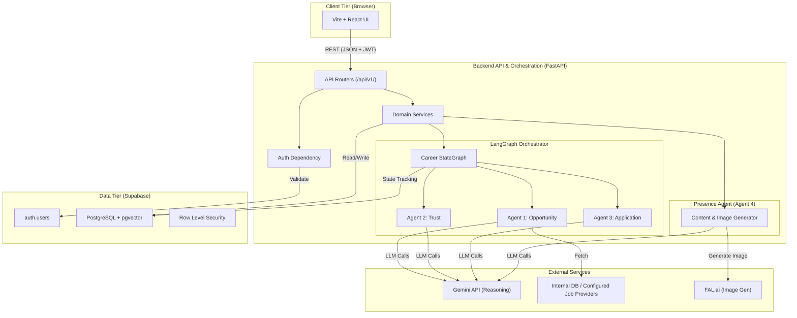
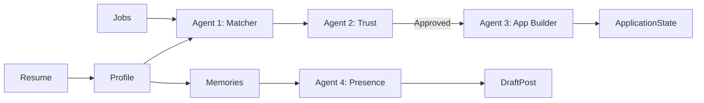

# 1. PROJECT TITLE

# CareerOS: When Student Skills Meet the Right Opportunities
> *An intelligent career orchestration platform that transforms passive job hunting into a continuous, verified, and automated professional journey.*

---

# 2. EXECUTIVE SUMMARY

CareerOS is an Agentic AI-powered career orchestration system designed for students navigating the entry-level tech job market. It solves the critical inefficiencies of the modern job search—manual discovery, repetitive applications, predatory employment scams, and inactive professional networks—by shifting the burden of execution from the student to an intelligent operating system. 

Instead of a traditional job board, CareerOS utilizes four specialized AI agents governed by a central LangGraph orchestrator. Once a student defines their profile, the system continuously discovers semantically matching opportunities, identifies skill gaps, verifies company trustworthiness to prevent fraud, tailors application packages, and drafts evidence-backed LinkedIn content. The student remains in absolute control via Human-in-the-Loop approval gates, transforming them from a manual applicant into an executive decision-maker of their own career.

---

# 3. PROBLEM STATEMENT

The transition from university to the professional world is broken. As students enter their 3rd or final year, they face an overwhelming and highly inefficient process:

1. They create a static resume.
2. They manually search job boards for "Software Engineer Intern."
3. They open a job, read the description, and manually map it to their skills.
4. They click "Apply" and spend 15 minutes filling out identical application forms.
5. They rarely have the time or expertise to deeply evaluate a company's trustworthiness, making them vulnerable to employment scams (e.g., upfront equipment fees).
6. They rarely optimize their resume for specific opportunities.
7. They inevitably miss highly relevant opportunities because manual searching doesn't scale.
8. They fail to maintain an active professional presence on LinkedIn because they don't know what to post or lack the time to draft content.

**TRADITIONAL STUDENT CAREER WORKFLOW:**
Student ↓ Search jobs ↓ Open job ↓ Read JD ↓ Decide manually ↓ Click Apply ↓ Fill form ↓ Repeat

This workflow simply does not scale. It leads to application fatigue, poor matching, and missed opportunities.

---

# 4. THE CORE IDEA

Instead of forcing students to manually operate career platforms, CareerOS introduces an intelligent orchestration system that continuously assists them.

The student's role shifts entirely. They simply:
1. **Define goals & preferences** (e.g., "Frontend Intern, Remote").
2. **Provide verified information** (Upload resume, confirm skills).
3. **Approve important decisions** (Click "Approve" on an application or LinkedIn post).

The AI agents handle the heavy lifting:
- **Discovery**: Finding relevant jobs.
- **Analysis**: Matching skills and identifying gaps.
- **Verification**: Ensuring the company is legitimate.
- **Preparation**: Tailoring resumes and drafting cover letters.
- **Automation**: Executing the application workflow.
- **Tracking**: Managing state transitions.
- **Professional Presence**: Drafting LinkedIn content based on verified career milestones.

---

# 5. WHY AGENTIC AI?

CareerOS is fundamentally different from a standard AI chatbot. 

**NORMAL CHATBOT:**
User asks → AI answers → Conversation ends.
*This requires continuous user prompting and operates without persistent memory or execution capabilities.*

**AGENTIC CAREER SYSTEM:**
Observe → Understand → Plan → Select tools → Execute → Verify → Ask for approval when required → Continue workflow → Update state → Trigger next agent.

An Agentic AI approach is required for this problem because:
- **Goal-Driven Execution**: The system doesn't just answer questions; it actively pursues the goal of securing a job.
- **Agent Specialization**: Evaluating a scam requires different logic and tools than drafting a LinkedIn post.
- **Shared State**: Agents read and write to a canonical database, maintaining a long-term memory of the student's career.
- **Verification & Human-in-the-Loop**: The system can pause its execution to ask the student, "Does this cover letter look good?" before proceeding.
- **Long-Running Workflows**: Career discovery is a continuous process that spans months, not a single chat session.

---

# 6. SOLUTION OVERVIEW

CareerOS is a closed-loop system where the student's profile directly fuels autonomous agents.

**Student Provides:**
- PDF Resume
- Extracted Skills & Education
- Target Roles (e.g., "Backend Engineer")
- Work Preferences (Remote/Hybrid)

**High-Level Flow:**
```text
                STUDENT
                   ↓
          CAREER PROFILE
                   ↓
         AI ORCHESTRATOR
                   ↓
     ┌─────────────┼─────────────┐
     ↓             ↓             ↓
 OPPORTUNITY     TRUST       APPLICATION
    AGENT        AGENT          AGENT
     │             │             │
     └─────────────┼─────────────┘
                   ↓
          CAREER JOURNEY
                   ↓
        LINKEDIN CONTENT AGENT
```

---

# 7. END-TO-END SYSTEM ARCHITECTURE

CareerOS utilizes a modern, multi-tier architecture to securely orchestrate AI agents and manage student career lifecycles.



---

# 8. THE FOUR AI AGENTS

CareerOS utilizes specialized agents to handle distinct phases of the career lifecycle.

### Agent 1 — Opportunity Discovery & Career Matching Agent
- **Purpose**: Identify highly relevant jobs based on the student's unique profile.
- **Input**: Vectorized resume chunks, extracted skills, user preferences.
- **Responsibilities**: Ingests job descriptions, normalizes data, and computes semantic match scores.
- **Tools**: `pgvector` similarity search, Job API connectors.
- **Interaction**: Passes matched jobs to Agent 2 for verification.
- **Current Status**: Implemented.

### Agent 2 — Trust & Company Verification Agent
- **Purpose**: Prevent students from falling victim to employment fraud.
- **Input**: Company name, domain, and raw job description.
- **Responsibilities**: Analyzes the job posting for scam indicators (upfront fees, brand impersonation).
- **Tools**: LLM heuristic analysis, domain verification.
- **Interaction**: If a job is flagged as `HIGH_RISK`, it permanently blocks Agent 3 from executing an application.
- **Current Status**: Implemented.

### Agent 3 — Application & Career Execution Agent
- **Purpose**: Prepare and execute the application payload.
- **Input**: Verified job data, canonical resume, user preferences.
- **Responsibilities**: Selects the most relevant resume chunks, drafts cover letters, and prepares Q&A responses.
- **Human Approval Points**: Always pauses at `AWAITING_APPROVAL` before finalizing the application package.
- **Current Status**: Implemented (Package preparation and manual approval).

### Agent 4 — Professional Presence & LinkedIn Content Agent
- **Purpose**: Solve the "inactive profile" problem by generating authentic content.
- **Input**: Verified "Career Memories" (e.g., portfolio project completion, internship milestones).
- **Responsibilities**: Drafts professional LinkedIn posts and generates complementary graphics.
- **Human Approval Points**: Content is drafted but requires explicit human approval before external publishing.
- **Current Status**: Partially Implemented (Draft generation and FAL.ai image generation are live; direct LinkedIn OAuth posting is planned).

---

# 9. AGENT 1 — OPPORTUNITY DISCOVERY

Relevance is calculated dynamically.

**Workflow:**
Student Profile ↓ Resume Understanding ↓ Target Role Understanding ↓ Opportunity Discovery ↓ Job Extraction ↓ Normalization ↓ Matching ↓ Skill Gap Analysis ↓ Resume Gap Analysis ↓ Student Feedback ↓ Profile Improvement ↓ Better Opportunity Discovery

**Supported Job Information Schema:**
- `job_title`: Extracted title.
- `company`: Employer name.
- `job_description`: Full text.
- `skills`: Required hard and soft skills.
- `remote_policy`: Remote, on-site, hybrid.
- `location`: Geographic requirement.
- `match_score`: 0.0 - 1.0 semantic similarity score.
- `skill_gaps`: Skills required by the job that the user lacks.

---

# 10. AGENT 2 — TRUST VERIFICATION

Job relevance is useless if the job is a scam. Agent 2 operates as a fail-closed security gateway.

**Workflow:**
Company ↓ Evidence Collection ↓ AI Analysis ↓ Risk Detection ↓ Trust Score ↓ Recommendation

**Possible Classifications:**
- **Trusted**: No risk indicators found.
- **Needs Review**: Minor anomalies detected.
- **High Risk**: Explicit scam indicators (e.g., demands $100 for onboarding software).
- **Insufficient Evidence**: Cannot verify the company domain.

*Limitations*: Online reviews can be biased, and AI analysis is not infallible. Therefore, Agent 2 strictly documents its `trust_evidence` in the database so the user can audit *why* a company was flagged.

---

# 11. AGENT 3 — APPLICATION EXECUTION

This agent transforms raw data into a compelling application package.

**Workflow:**
Opportunity Selected ↓ Trust Verified ↓ Resume Selection ↓ Application Preparation ↓ Form Understanding ↓ Human Approval ↓ Application Tracking

**Separation of Powers:**
- **AUTONOMOUS ACTIONS**: Analyzing the job description, filtering resume chunks, drafting the cover letter.
- **APPROVAL REQUIRED ACTIONS**: Finalizing the application payload for submission.
- **HUMAN-ONLY ACTIONS**: Accepting legally binding agreements or falsifying experience. The student remains in absolute control.

*Note: Automated browser injection into Workday/Taleo portals is planned for future scope. Currently, Agent 3 prepares the highly tailored payload for the user.*

---

# 12. AGENT 4 — PROFESSIONAL PRESENCE

An inactive LinkedIn profile is a missed opportunity. However, Agent 4 is explicitly restricted from inventing fake achievements or "hustle culture" spam.

The objective is: **AUTHENTIC + CONSISTENT + EVIDENCE-BACKED PROFESSIONAL PRESENCE**.

**Workflow:**
Student Profile ↓ Content Opportunity Detection ↓ Research ↓ Content Generation ↓ Fact Verification ↓ Student Approval ↓ Publishing

**Possible Content Origins:**
- "Career Memories" explicitly logged in the system (e.g., "Finished a React portfolio project").
- Technical knowledge demonstrations based on verified skills.

Agent 4 uses FAL.ai to generate a visually appealing image to accompany the drafted post, requiring final human approval before the user copies it to LinkedIn.

---

# 13. THE ORCHESTRATOR

The Orchestrator (powered by LangGraph) is the absolute core of CareerOS. Without it, the four agents would collide, hallucinate, and desynchronize.

The orchestrator is a strict state machine responsible for:
- **Task Routing**: Determining which agent runs next.
- **Context Passing**: Injecting the user's latest verified resume into the prompt.
- **Approval Gates**: Halting execution and transitioning the database state to `AWAITING_APPROVAL`.
- **Audit Trails**: Logging every transition to `agent_runs` and `agent_steps`.

**Example Execution Loop:**
Determine required action ↓ Call Agent 1 ↓ Receive Job ↓ Validate Result ↓ Call Agent 2 ↓ Receive Trust Score ↓ Request User Approval ↓ User Approves ↓ Call Agent 3 ↓ Update State.

---

# 14. AGENT-TO-AGENT COLLABORATION

The system is ONE coordinated career intelligence engine, not four independent features.

1. **Agent 1** discovers a frontend opportunity.
2. **Agent 2** verifies the startup is legitimate.
3. **The Orchestrator** flags a missing skill ("Redux") and asks the user. The user confirms they know it.
4. **Agent 3** prepares an application emphasizing Redux.
5. **The Student** approves the application.
6. **Agent 4** detects the successful application and drafts a LinkedIn post about the student's journey learning Redux.

---

# 15. SHARED MEMORY / CAREER STATE

To collaborate safely, all agents read from and write to a canonical Supabase PostgreSQL database. 

**Shared State Entities:**
- Canonical `career_profiles` and `skills`.
- Vectorized `resumes` and `resume_chunks`.
- Normalized `jobs`.
- Evidence-backed `trust_assessments`.
- State-tracked `applications`.
- Verified `career_memories`.

This shared state ensures Agent 3 doesn't try to apply to a job that Agent 2 just flagged as a scam, and prevents Agent 4 from inventing skills that aren't in the canonical profile.

---

# 16. HUMAN-IN-THE-LOOP

CareerOS operates on a philosophy of **Least-Privilege Autonomy**.

> **AI proposes. Evidence validates. Rules decide. Human approves important actions. Agents execute approved actions.**

**Crucial Approval Gates:**
- **Application Submission**: The system never applies to a job blindly. It prepares the package and waits for consent.
- **Skill Addition**: If the system detects a missing skill, it asks the user to confirm they possess it before modifying the canonical profile.
- **Content Publishing**: Agent 4 only drafts posts; the user must approve and publish them.

This ensures students maintain ethical control over their professional representation.

---

# 17. COMPLETE USER JOURNEY

A student enters their final year and uploads their resume to CareerOS, targeting "Frontend Engineer" roles.

1. The system vectorizes their resume and extracts their skills (React, TypeScript).
2. **Agent 1** constantly scans the internal job database and discovers a matching role at "InnovateTech."
3. **Agent 1** notices the job requires "Next.js". The system asks: *"Do you have experience with Next.js?"* The student confirms and updates their profile.
4. The student clicks "Pursue".
5. **Agent 2** evaluates InnovateTech. It finds no upfront fee demands and verifies the corporate domain. It flags the job as `TRUSTED`.
6. **Agent 3** dynamically selects the resume chunks highlighting React/Next.js and drafts a custom cover letter.
7. The system pauses at `AWAITING_APPROVAL`.
8. The student reviews the tailored application package and clicks "Approve".
9. The application state updates to `APPLIED`.
10. Weeks later, the student logs a "Career Memory" that they completed a Next.js tutorial.
11. **Agent 4** drafts an evidence-backed LinkedIn post about the tutorial, generates a graphic, and asks for approval.
12. The student approves and publishes it, increasing their recruiter visibility.

---

# 18. COMPLETE CAREER LOOP

CareerOS creates two continuously reinforcing feedback loops:

**The Application Loop:**
PROFILE ↓ OPPORTUNITIES ↓ MATCHING ↓ GAPS ↓ IMPROVEMENT ↓ APPLICATION ↓ TRACKING ↓ EXPERIENCE ↓ PROFILE UPDATE ↓ BETTER OPPORTUNITIES

**The Presence Loop:**
PROFILE ↓ CONTENT ↓ PROFESSIONAL PRESENCE ↓ RECRUITER VISIBILITY ↓ NEW OPPORTUNITIES

As the student applies to jobs, they learn what skills they lack. As they learn those skills, Agent 4 helps them post about it. Those posts attract recruiters, resulting in new opportunities.

---

# 19. DATA FLOW

Data flows strictly through validated API boundaries and the Orchestrator.



---

# 20. TECHNICAL IMPLEMENTATION

CareerOS is built on a modern, decoupled stack, prioritizing python's AI ecosystem for the backend and React's speed for the frontend.

| Layer | Technology | Purpose |
| :--- | :--- | :--- |
| **Frontend** | Vite, React 18, Tailwind CSS | UI Presentation & Dashboards |
| **Backend API** | FastAPI (Python 3.11) | High-performance routing & validation |
| **Orchestrator** | LangGraph, LangChain | State machine coordination of agents |
| **Database** | Supabase (PostgreSQL) | Canonical data persistence |
| **Vector Search** | `pgvector` | 768-dim semantic similarity matching |
| **AI Reasoning** | Gemini / OpenAI APIs | Core agent intelligence & text extraction |
| **Image Generation**| FAL.ai | Graphic generation for Agent 4 |

---

# 21. PROJECT STRUCTURE

```text
linkedin_orchestrator/
├── apps/
│   ├── api/                 # FastAPI backend & LangGraph Agents
│   │   ├── app/
│   │   │   ├── api/v1/      # REST Endpoints (routers)
│   │   │   ├── domain/      # Core logic, schemas, agent definitions
│   │   │   └── services/    # Agent logic & provider implementations
│   └── web/                 # Vite + React frontend
│       ├── public/          # Static assets
│       └── src/             # UI Components & Pages
├── supabase/
│   └── migrations/          # 30+ sequential SQL migrations defining the schema
├── package.json             # Root monorepo workspace configuration
└── README.md                # Single Source of Truth Documentation
```

---

# 22. API / DATABASE / INTEGRATIONS

### API Architecture
The FastAPI backend serves routes under `/api/v1/`. Key endpoints include:
- `POST /api/v1/resumes/upload`: Triggers asynchronous parsing and vector embedding.
- `POST /api/v1/matches/compute`: Forces Agent 1 to re-evaluate semantic match scores.
- `GET /api/v1/trust/{job_id}`: Retrieves Agent 2's scam assessment.
- `POST /api/v1/applications/prepare`: Instructs Agent 3 to build the application payload.
- `POST /api/v1/presence/draft-from-memory`: Instructs Agent 4 to generate a post and image.

### Database Architecture
Supabase relies heavily on `pgvector`. 
- **Core tables**: `career_profiles`, `resumes`, `jobs`, `applications`, `trust_assessments`, `agent_runs`, `presence_content`.
- **Idempotency**: Unique constraints on `(source, external_id)` in the `jobs` table prevent duplicate agent runs.

### External Integrations
- **Gemini / OpenAI**: Utilized via an abstracted `AIProvider` interface.
- **FAL.ai**: Generates `.webp` images based on Agent 4 prompts.

---

# 23. SECURITY & PRIVACY

Because CareerOS handles highly sensitive PII (resumes), security is foundational.

- **Authentication**: Supabase Auth (JWT) is required for all backend routes.
- **Row Level Security (RLS)**: 100% of the 30+ database tables enforce RLS based on `auth.uid()`. Even if the API is bypassed, the database strictly isolates tenant data.
- **Prompt Injection**: Untrusted external content (like job descriptions) is heavily sanitized before being passed to LLMs.
- **SSRF Mitigation**: Job ingestion limits outbound HTTP requests to prevent Server-Side Request Forgery.
- **Secrets Management**: No API keys or service roles are committed. Everything loads from local `.env` files via Pydantic settings.

---

# 24. FAILURE HANDLING

The Orchestrator ensures graceful degradation.

- **LLM Fails**: The system falls back to a deterministic `MockAIProvider` (or retries) so the UI doesn't crash.
- **Trust API Timeout**: Agent 2 is fail-closed. If verification fails, the job remains in `TRUST_CHECK_PENDING` and cannot be applied to.
- **User Rejects Action**: If a student rejects an application draft, the state machine transitions back to `READY_TO_APPLY`, awaiting further instructions without failing the workflow.

---

# 25. TESTING & VALIDATION

The project includes an evaluation framework for testing agent quality.
- **Unit/Integration Tests**: Validates backend logic and state transitions (FastAPI test suite).
- **Agent Validation**: Ensures the LLM strictly adheres to structured JSON outputs (Pydantic validation).
*(Note: Full end-to-end browser testing is planned for future scope).*

---

# 26. IMPLEMENTATION STATUS

### ✅ Implemented
- **Frontend & Backend Base**: Vite + React SPA and FastAPI backend communicating via REST.
- **Database Architecture**: 30 Supabase migrations including `pgvector` and comprehensive RLS policies.
- **Orchestrator**: The LangGraph engine controlling state transitions and agent routing.
- **Agent 1 (Discovery)**: Resume parsing, chunking, and semantic matching against the internal job database.
- **Agent 2 (Trust)**: Database models and heuristic assessment service for flagging high-risk jobs.
- **Agent 3 (Application)**: Package preparation (tailoring resumes and drafting responses) up to the manual human approval gate.
- **Agent 4 (Presence)**: The `/api/v1/presence` endpoints for translating career memories into text drafts and FAL.ai generated images.

### ⚠️ Partially Implemented
- **Live LLM Connectivity**: The backend currently defaults to a `MockAIProvider` for safe, cost-free local development. Switching to the live Gemini API requires a config change.
- **Job Ingestion**: Works via specific internal data and provided URLs; arbitrary, massive-scale web scraping is intentionally disabled.

### 🚀 Future Scope
- **Browser Automation (Agent 3)**: Automatically injecting the tailored payload into external portals like Workday/Taleo.
- **LinkedIn API Auth (Agent 4)**: Direct OAuth integration to automatically publish scheduled posts to LinkedIn (currently requires manual copy-paste).
- **Skill Learning Agent**: A future agent that recommends specific Udemy/Coursera courses to fill identified skill gaps.

---

# 27. CURRENT LIMITATIONS

- **External Platform Restrictions**: We cannot fully automate job applications on platforms with aggressive bot-protection without violating Terms of Service. Hence, Agent 3 prepares the payload for the user.
- **LinkedIn Restrictions**: Direct posting requires LinkedIn API approval, which is restricted for new apps.
- **AI Hallucinations**: While minimized via strict schemas and grounded career memories, LLMs can still hallucinate. The Human-in-the-Loop gates are mandatory workarounds for this limitation.

---

# 28. WHY THIS IS DIFFERENT

**Traditional Job Portal:**
Search → Open → Read → Apply → Repeat.

**CareerOS:**
Understand Student → Discover → Semantically Match → Identify Gaps → Verify Company Trust → Prepare Tailored Application → Ask Approval → Apply → Track → Maintain Professional Presence → Continuously Improve.

This is an Agentic AI system because it maintains state, uses tools, executes multi-step workflows, and actively protects the user, rather than simply returning search results.

---

# 29. EXPECTED IMPACT

- **For Students**: Reduces the manual labor of application formatting from hours to seconds. Prevents them from being scammed by fraudulent job postings. Actively builds their professional brand on LinkedIn.
- **For Recruiters**: Increases the quality of applications they receive, as candidates are semantically matched and specifically tailored to the role, rather than generic spam.
- **Career Intelligence**: Transforms the job hunt into a measurable, improvable process.

---

# 30. FUTURE ROADMAP

- **Interview Preparation Agent**: An agent that conducts mock voice interviews based on the specific job description the student applied to.
- **Recruiter Interaction Intelligence**: AI-drafted responses for recruiter emails and LinkedIn direct messages.
- **Automated Portfolio Generation**: Spinning up a Next.js personal website dynamically based on the student's canonical career profile.

---

# 31. CONCLUSION

The modern entry-level job hunt is overwhelming, repetitive, and occasionally dangerous due to employment scams. 

CareerOS solves this by recognizing that students don't need another job board—they need an intelligent career orchestrator. By combining the deterministic control of LangGraph with the reasoning capabilities of specialized Agentic AI, the platform seamlessly connects a student's true skills to safe opportunities, verified applications, and continuous professional growth. 

Through strict Human-in-the-Loop approvals, the system ensures the student remains the executive decision-maker, while the agents execute the manual labor.

---

# 32. FINAL ONE-LINE VISION

> *From passive job searching to an intelligent, continuously evolving career journey.*
